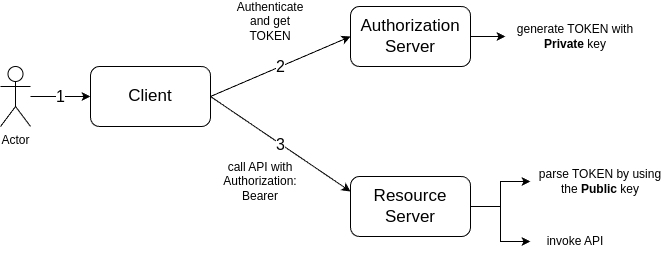

#### Generate Public and Private key. Use Private key for TOKEn sign, and Public key for TOKEN verification
- openssl genrsa -out private_key.pem 4096
- openssl rsa -pubout -in private_key.pem -out public_key.pem

#### Flow

